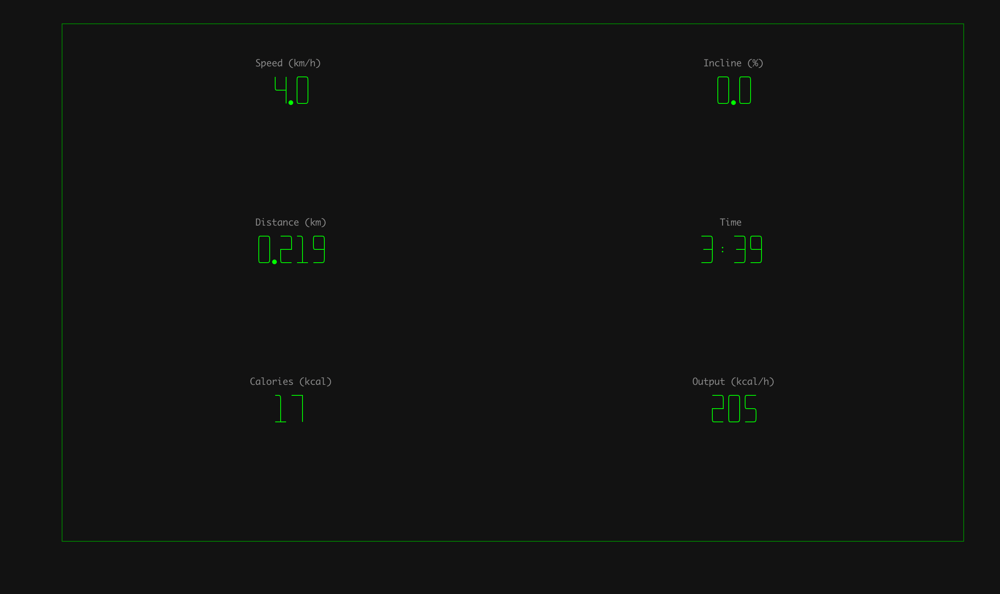

# 🏃‍♂️ Treddy Mercury

> "Don't stop me now, I'm having such a good time!" 🎶

Reverse engineering the **NT s20i** because I need a distraction while larping as a hamster on their wheel. 

## 🚀 Usage

Dependencies are managed via `uv`, so just run:

```bash
./run.sh
```

This will launch the TUI (Textual User Interface), connect to the treadmill via BLE, and start tracking your run.

Runs are:
1. Saved locally to `data/`.
2. Automatically uploaded to Fitbit when the app starts.

## 📸 Functionality

- **Live Dashboard**: Shows speed, incline, distance, time, and calories.
- **Calorie Tracking**: Uses ACSM metabolic equations and your Fitbit weight profile for accuracy.
- **Auto-Sync**: Background uploads to Fitbit.


